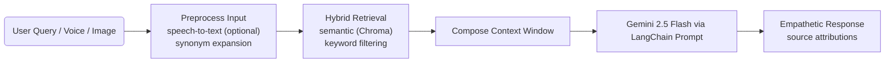

# RAG Assignment

MindfulRAG is an AI-assisted mental health companion that combines a Retrieval-Augmented Generation (RAG) pipeline with multimodal inputs to provide empathetic, evidence-aligned guidance. It never replaces professional care and only surfaces supportive suggestions grounded in trusted references.

> **Disclaimer:** This prototype does not offer clinical advice. If you or someone you know is in crisis, please reach out to a licensed professional or emergency services immediately.

## Problem Statement
- **Clear problem definition:** Offer a safe conversational space where users can express their feelings and receive supportive, literature-backed coping suggestions. The assistant must ground its answers in curated mental health resources, remain multilingual, and accept text, voice, and optional image cues while respecting the limits of non-clinical support.

## Dataset / Knowledge Source
- **Type of data (PDF, TXT, DOCX, Web, etc.):** Curated PDF manuals, workbooks, and psychoeducational guides focused on anxiety, depression, stress management, and mindfulness.
- **Data source (public / self-created):** Publicly available resources placed manually inside the `data/` directory; the repository does not redistribute copyrighted material.

## RAG Architecture
- **Block diagram of complete RAG pipeline:**


- **Core components:** `ingest.py` performs document loading, chunking, embedding, and persistence; `backend_multimodal.py` loads the vector store, orchestrates retrieval, and builds the prompt; `streamlit_app_multilingual.py` handles multilingual chat, voice, and optional image inputs.

## Text Chunking Strategy
- **Chunk size:** 1,500 characters.
- **Chunk overlap:** 100 characters.
- **Reason for chosen strategy:** Balances contextual continuity for therapeutic techniques (often explained across paragraphs) with manageable embedding size, reducing truncation while remaining fast on CPU-bound environments.

## Embedding Details
- **Embedding model used:** Sentence-transformers `all-MiniLM-L6-v2` via `HuggingFaceEmbeddings`.
- **Reason for selecting the model:** Light-weight, CPU-friendly, strong performance on semantic similarity, and readily available under a permissive license suitable for local execution.

## Vector Database
- **Vector store used (FAISS / Chroma / etc.):** Persistent `Chroma` store at `chroma_db/`.
- **Metadata captured:** Source file path, page number, and chunk index enabling citation in chat responses and future filtering.

## Notebook Implementation
- **Step-wise code (data loading → retrieval → generation):**

```python
from langchain_community.document_loaders import DirectoryLoader, PyPDFLoader
from langchain.text_splitter import RecursiveCharacterTextSplitter
from langchain_community.embeddings import HuggingFaceEmbeddings
from langchain_community.vectorstores import Chroma
from langchain_google_genai import ChatGoogleGenerativeAI

# 1. Load and split documents
loader = DirectoryLoader("data", glob="*.pdf", loader_cls=PyPDFLoader)
docs = loader.load()
splitter = RecursiveCharacterTextSplitter(chunk_size=1500, chunk_overlap=100)
chunks = splitter.split_documents(docs)

# 2. Embed and persist
embeddings = HuggingFaceEmbeddings(model_name="all-MiniLM-L6-v2", model_kwargs={"device": "cpu"})
vectorstore = Chroma.from_documents(chunks, embeddings, persist_directory="chroma_db")
vectorstore.persist()

# 3. Retrieve and generate
retriever = vectorstore.as_retriever(search_kwargs={"k": 5})
context_docs = retriever.get_relevant_documents("How do I calm anxiety before sleep?")
context = "\n\n".join(doc.page_content for doc in context_docs)

prompt = """You are a compassionate mental health support assistant.
Context:\n{context}\n\nUser question: {question}\n""".format(context=context, question="How do I calm anxiety before sleep?")

llm = ChatGoogleGenerativeAI(model="gemini-2.5-flash", temperature=0.3)
response = llm.invoke(prompt)
print(response.content)
```
- **Proper comments and markdown cells:** Annotate notebook cells with short MD sections (Overview, Ingestion, Retrieval, Generation) and inline comments explaining non-trivial steps such as the hybrid retrieval heuristic.
- **Minimum 3 test queries with outputs:**
	1. *“I feel overwhelmed at work, how can I cope?”* → Suggests breathing, task prioritisation, and cites stress-management workbook pages.
	2. *“Any gentle grounding technique before exams?”* → Recommends 5-4-3-2-1 technique and mindful breathing references.
	3. *“How to support a friend showing signs of burnout?”* → Highlights listening skills, professional referral encouragement, and relevant resource snippets.

## Future Improvements
- **Better chunking:** Experiment with semantic-aware or adaptive chunking to preserve exercises, tables, or checklists intact.
- **Reranking / hybrid search:** Integrate rerankers such as `bge-reranker-large` for tighter relevance ordering after initial recall.
- **Metadata filtering:** Use tags (topic, modality, difficulty level) during ingestion to filter retrieval for user intent.
- **UI integration:** Extend the current Streamlit front-end with progress tracking, journaling, and hand-off pathways to professional services.

## README / Report
- **Project overview:** MindfulRAG combines curated psychoeducational PDFs with Gemini 2.5 Flash to deliver multilingual, empathetic conversations under a strict non-clinical policy.
- **Tools & libraries used:** LangChain, Chroma, HuggingFace Sentence Transformers, Google Generative AI, Streamlit, SpeechRecognition, Pillow.
- **Instructions to run the notebook:**
	1. Create and activate a virtual environment, then install `requirements.txt`.
	2. Launch Jupyter (`pip install jupyter` if needed) and open a new notebook in the repository root.
	3. Copy the code blocks from the “Notebook Implementation” section, execute sequentially, and ensure a valid `GOOGLE_API_KEY` is loaded via `.env` or notebook environment variables.
	4. Replace the sample query with your own and inspect both the retrieved context snippets and generated response cells.


- **Streamlit:** Launch the conversational UI with `streamlit run streamlit_app_multilingual.py`. The app supports text and  optional voice capture (SpeechRecognition).